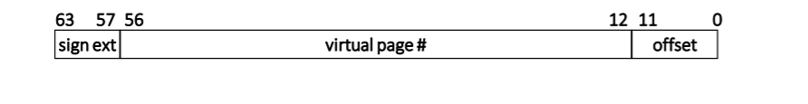

# Multi-Level Page Tables Assignment

## goal
The goal in this assignment is to implement simulated OS code that handles a multi-level (trie-based)
page table. I was needed to implement two functions. The first function creates/destroys virtual memory
mappings in a page table. The second function checks if an address is mapped in a page table. (The
second function is needed if the OS wants to figure out which physical address a process virtual
address maps to.)

My code is a simulation because it runs in a normal process. I was provided with two files,
os.c and os.h, which contain helper functions that simulate some OS functionality that my code
will need to call.  there’s also a main() function demonstrating usage of the
code.

##  Target hardware
Our simulated OS targets an imaginary 64-bit x86-like CPU. When talking about addresses (virtual
or physical), we refer to the least significant bit as bit 0 and to the most significant bit as bit 63.


**Virtual addresses** The virtual address size of our hardware is 64 bits, of which only the lower
57 bits are used for translation. The top 7 bits are guaranteed to be identical to bit 56, i.e., they
are either all ones or all zeroes. The following depicts the virtual address layout:

**Physical addresses** The physical address size of our hardware is also 64 bits.

**Page table structure** The page/frame size is 4 KB (4096 bytes). Page table nodes occupy a
physical page frame, i.e., they are 4 KB in size. The size of a page table entry is 64 bits. Bit 0 is the
valid bit. Bits 1–11 are unused and must be set to zero. (This means that our target CPU does
not implement page access rights.) The top 52 bits contain the page frame number that this entry
points to. The following depicts the PTE format:


## the functions
1. A function to create/destroy virtual memory mappings in a page table:

    ```c
    void page_table_update(uint64 t pt, uint64 t vpn, uint64 t ppn);
    ```

    This function takes the following arguments:

    * `pt`: The physical page number of the page table root (this is the physical page that the
    page table base register in the CPU state will point to).
    * `vpn`: The virtual page number the caller wishes to map/unmap.
    * `ppn`: Can be one of two cases. If ppn is equal to a special `NO MAPPING` value (defined in
    os.h), then vpn’s mapping should be destroyed. Otherwise, ppn specifies the physical page
    number that vpn should be mapped to.

2. A function to query the mapping of a virtual page number in a page table:
    ```c
    uint64 t page_table_query(uint64 t pt, uint64 t vpn);
    ```
    This function returns the physical page number that vpn is mapped to, or `NO MAPPING` if no
    mapping exists. The meaning of the pt argument is the same as with page_table_update().

## compile:

```cmd
gcc -O3 -Wall -std=c11 os.c pt.c
```